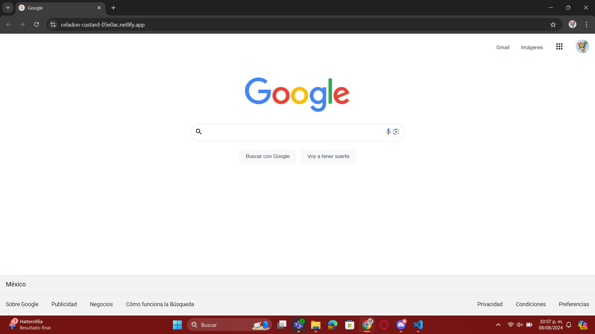

# Clon de Google

El siguiente proyecto es una copia de la página principal de Google, fue desarrollado para poner en práctica las habilidades obtenidas del bootcamp de desarrollo frontend de Tecnolochicas PRO.

[Proyecto desplegado (https://celadon-custard-05e0ac.netlify.app/)](https://celadon-custard-05e0ac.netlify.app/)

## Secciones de mi sitio

## Tecnología

* HTML
* CSS

---

Desarrollado por [Lluvia](https://www.instagram.com/rain.colors0506?igsh=ajJ5cGZxdm1haGM3) en [TECHNOLOCHICAS PRO](https://tecnolochicas.mx/)